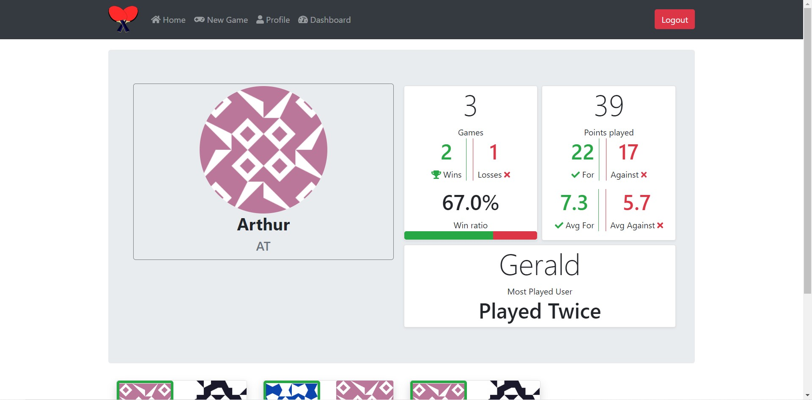

# Table Tennis Scoreboard - A web based scoreboard with optional RGB Matrix support

---
## Features
  -Complete user authentication, with encrypted passwords
  -Table tennis scoreboard (Up to 11 points) with tiebreak and serving indicator
   -Saving games from the scoreboard to track progress
  -Statistics views: User stats as well as a global league table
  -Optional RGB Matrix support

---
## Credits
  -[Flask](https://flask.palletsprojects.com/en/1.1.x/) Webserver
  -[Bootstrap 4](https://getbootstrap.com/) Site styling
  -[Data Tables](https://datatables.net/) Data table for home page
  -[Fontawesome](https://fontawesome.com/) Icons

---
## Screenshots

---
## Installation
1. Clone the repo `git clone https://github.com/cp2004/Scoreboard-web`

2. Browse the config file config.py, make any changes:
    - Path to RGB Matrix (If required)

3. Create a virtual environment if needed (`python -m virtualenv NAME`)

4. Install dependencies `pip install -r requirements.txt`

5. Run with `flask run`

6. PLAY!
